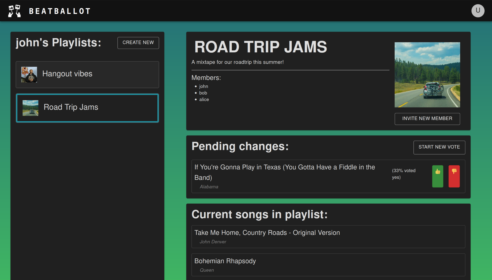

# Beat Ballot
*Made by Jaxson Pahukula, Joylyn Pan, Jiwon Seo and Avishi Goyal in 36 hours for [Boilermake XI](https://boilermake-xi.devpost.com/)*

This is BeatBallot, the world's first democratic music curator. With BeatBallot, you can join your friends in creating collaborative playlists, voting on which songs should stay and which should go!

## Inspiration

Sometimes, we find our friends’ music tastes a bit questionable, but they disagree. Well, majority rules when you collaborate with BeatBallot! Our app allows users to merge their preferences: truly democratic playlist curation, at the click of a vote button. 


## Features

Users can create shared spotify playlists and invite their friends to collaborate. Anyone in a group can suggest songs, which will then show up in other member’s pages to be voted on. Songs with more yay's than nay's will make the playlist; others will be dropped. 

## How it was made

This web app was created with React and MUI on the front end, with Flask and SQLite on the backend, with the help of the Spotify API.
